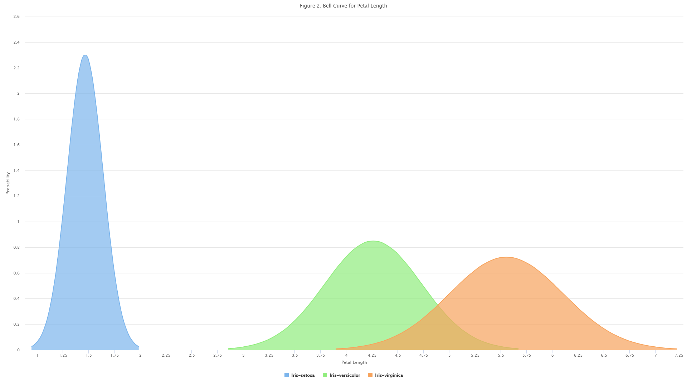
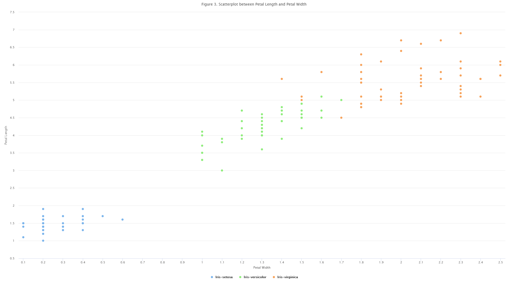
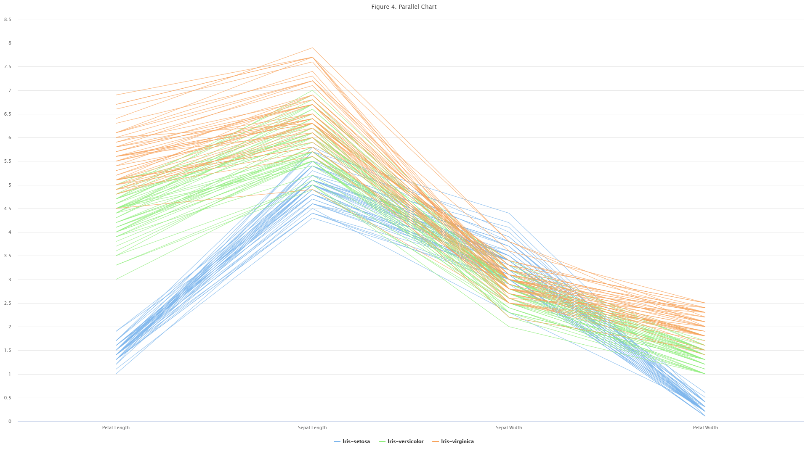
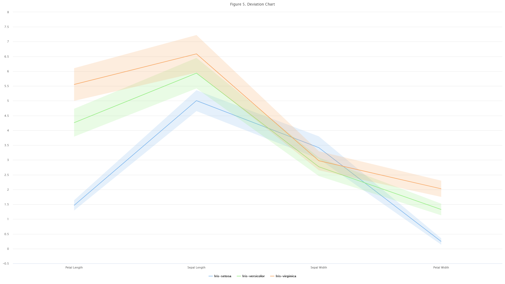

# Data-Visualization

The Figure 1 below shows the distribution of petal length for each of the three types of Irises. The Iris-setosa has the petal length of 1.5 as the biggest frequency for that type of iris with 14. The Iris-versicolor has the petal length of 4.5 as the biggest frequency for that type of iris with 7. The Iris-virginica has the petal length of 5.125 as the biggest frequency for that type of iris with 9.

Figure 2 describes the normal distribution for all three types of the Irises. Iris-setosa has a normal distribution with a mean around 1.5. Iris-versicolor shows a normal distribution with a mean of 4.25 and Iris-virginica shows a normal distribution with a mean of 5.625.

The Scatterplot between Petal Length and Petal Width is described on Figure 3. According to the data visualization from Fig. 3, the Iris-setosa has a petal width lower than 0.6 and petal length lower than 2.0. In addition, the scatterplot shows that all Iris-versicolor have a distribution between a petal width of 1 & 1.7. The Petal length of the Iris-versicolor distributes between 3 and 5.125.

According to the parallel chart showed in Fig 4. the biggest individual measure from the four different ones is the Sepal length when the smallest measure is the petal width. This is true for each of the three irises.

According to the deviation chart showed in Fig 5. the biggest individual measure from the four different ones is the Sepal length when the smallest measure is the petal width. This is true for each of the three irises.

