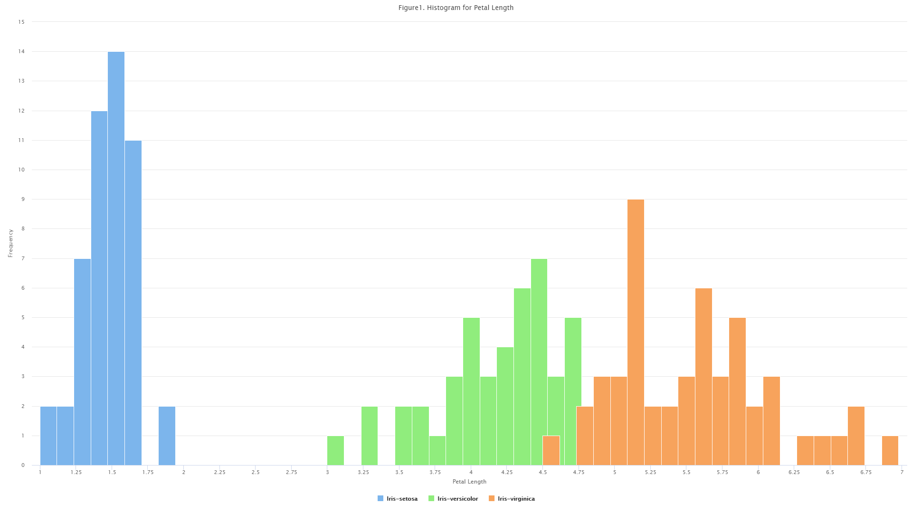

# Data-Visualization

The Figure 1 below shows the distribution of petal length for each of the three types of Irises. The Iris-setosa has the petal length of 1.5 as the biggest frequency for that type of iris with 14. The Iris-versicolor has the petal length of 4.5 as the biggest frequency for that type of iris with 7. The Iris-virginica has the petal length of 5.125 as the biggest frequency for that type of iris with 9.

